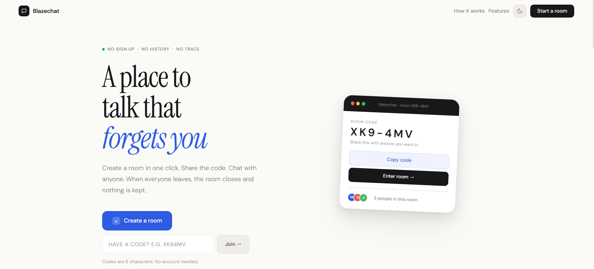

<div align="center">


# Blazechat

### Anonymous real-time chat rooms that disappear when everyone leaves.



**[Live Demo →](https://blazechat-three.vercel.app)**

</div>

---

## What is Blazechat?

Blazechat is a real-time anonymous chat application. Create a room in one click, share the 6-character code with anyone, and start chatting instantly — no login, no account, no data stored anywhere. When the last person leaves, the room and all its messages are permanently deleted.

---

## Features

- **Zero accounts** — no signup, no email, no password. Ever.
- **Instant rooms** — one click creates a live room with a unique 6-character code
- **Anonymous aliases** — auto-assigned names like MidnightOwl or SilverFern keep conversations human without revealing identity
- **Real-time messaging** — messages appear instantly via WebSockets
- **Typing indicators** — see when others are composing in real time
- **Rooms self-destruct** — last person leaves, room closes, messages deleted permanently
- **Refresh persistence** — page refresh keeps you in the room via sessionStorage
- **Duplicate name handling** — if two people pick the same name, backend quietly appends a number
- **Dark mode** — full dark and light mode support
- **Mobile responsive** — works on any device, any browser

---

## Tech Stack

| Layer | Technology |
|---|---|
| Frontend | React 19, Vite, React Router, Tailwind CSS |
| Backend | Node.js, Express, Socket.io |
| Real-time | WebSockets via Socket.io |
| Deployment | Vercel (client), Railway (server) |
| Storage | None — everything lives in server memory |

---

## Project Structure

```
blazechat/
├── client/                   # React frontend
│   ├── src/
│   │   ├── pages/
│   │   │   ├── Landing.jsx   # Home page
│   │   │   ├── PreJoin.jsx   # Name selection
│   │   │   └── Room.jsx      # Chat interface
│   │   ├── components/
│   │   │   ├── RoomModal.jsx
│   │   │   ├── Sidebar.jsx
│   │   │   ├── ChatWindow.jsx
│   │   │   ├── MessageBubble.jsx
│   │   │   └── TypingIndicator.jsx
│   │   ├── hooks/
│   │   │   └── useSocket.js
│   │   ├── utils/
│   │   │   └── nameGenerator.js
│   │   ├── App.jsx
│   │   └── socket.js
│   └── package.json
└── server/                   # Node.js backend
    ├── src/
    │   ├── index.js
    │   ├── roomStore.js
    │   ├── codeGenerator.js
    │   └── handlers/
    │       ├── roomHandlers.js
    │       ├── messageHandlers.js
    │       └── typingHandlers.js
    └── package.json
```

---

## How It Works

```
User clicks Create Room
  → frontend emits create-room to backend via Socket.io
  → backend generates unique code, stores room in memory
  → backend emits room-created back with the code
  → user sees modal with code, navigates to PreJoin
  → user picks alias, enters room
  → frontend emits join-room with code and name
  → backend adds user to room, notifies all members
  → messages flow in real time via send-message / new-message events
  → last person leaves → backend deletes room, all messages gone
```

---

## Running Locally

**Prerequisites:** Node.js 18+

**1. Clone the repo**
```bash
git clone https://github.com/MdLaraib25/blazechat
cd blazechat
```

**2. Install dependencies**
```bash
cd server && npm install
cd ../client && npm install
```

**3. Set up environment variables**

Create `server/.env`:
```
PORT=3001
CLIENT_URL=http://localhost:5173
```

Create `client/.env`:
```
VITE_SERVER_URL=http://localhost:3001
```

**4. Start the server**
```bash
cd server
npm run dev
```

**5. Start the client**
```bash
cd client
npm run dev
```

Open [http://localhost:5173](http://localhost:5173) in two browser tabs. Create a room in one, join with the code in the other.

---

## Deployment

| Service | Folder | Config |
|---|---|---|
| Railway | `server/` | Root directory: `server`, Start: `node src/index.js` |
| Vercel | `client/` | Root directory: `client`, Build: `npm run build` |

**Environment variables on Railway:**
```
CLIENT_URL=https://blazechat-three.vercel.app
PORT=3001
```

**Environment variables on Vercel:**
```
VITE_SERVER_URL=https://your-railway-url.up.railway.app
```

---

## Socket Events

| Event | Direction | Description |
|---|---|---|
| `create-room` | Client → Server | Create a new room |
| `room-created` | Server → Client | Returns new room code |
| `join-room` | Client → Server | Join an existing room |
| `room-joined` | Server → Client | Returns members and messages |
| `room-error` | Server → Client | Room not found |
| `user-joined` | Server → All others | Someone joined |
| `leave-room` | Client → Server | User leaving intentionally |
| `user-left` | Server → All others | Someone left |
| `send-message` | Client → Server | Send a message |
| `new-message` | Server → All in room | Deliver message to everyone |
| `typing-start` | Client → Server | User started typing |
| `user-typing` | Server → All others | Show typing indicator |
| `typing-stop` | Client → Server | User stopped typing |
| `user-stopped-typing` | Server → All others | Hide typing indicator |

---

## Live Demo

**[blazechat-three.vercel.app](https://blazechat-three.vercel.app)**

Open in two browser tabs to test the full real-time experience.

---

<div align="center">
  <sub>Built with React, Node.js, and Socket.io — no accounts, no logs, gone when you leave.</sub>
</div>